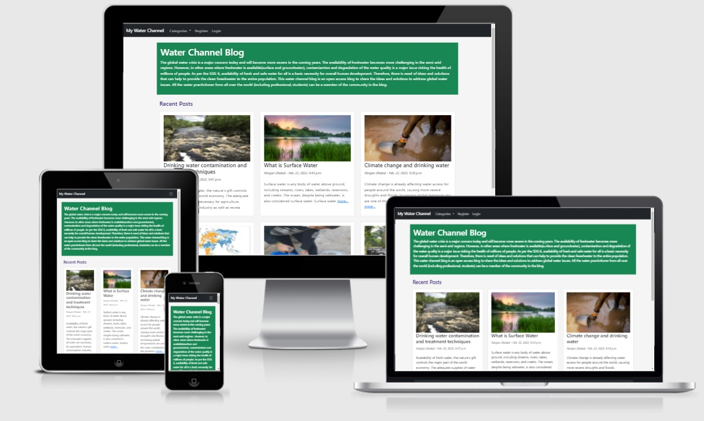
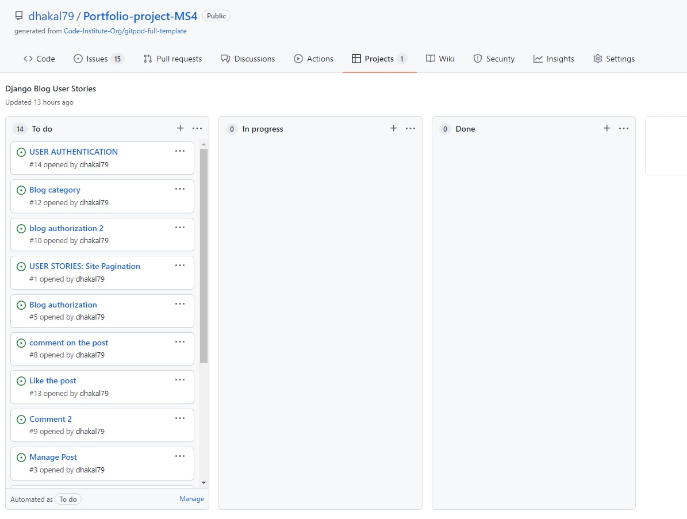
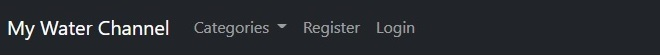
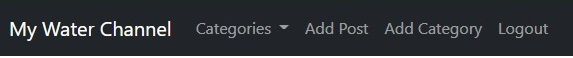
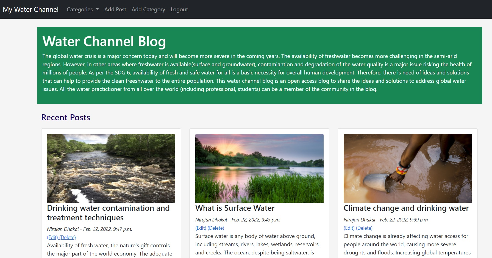
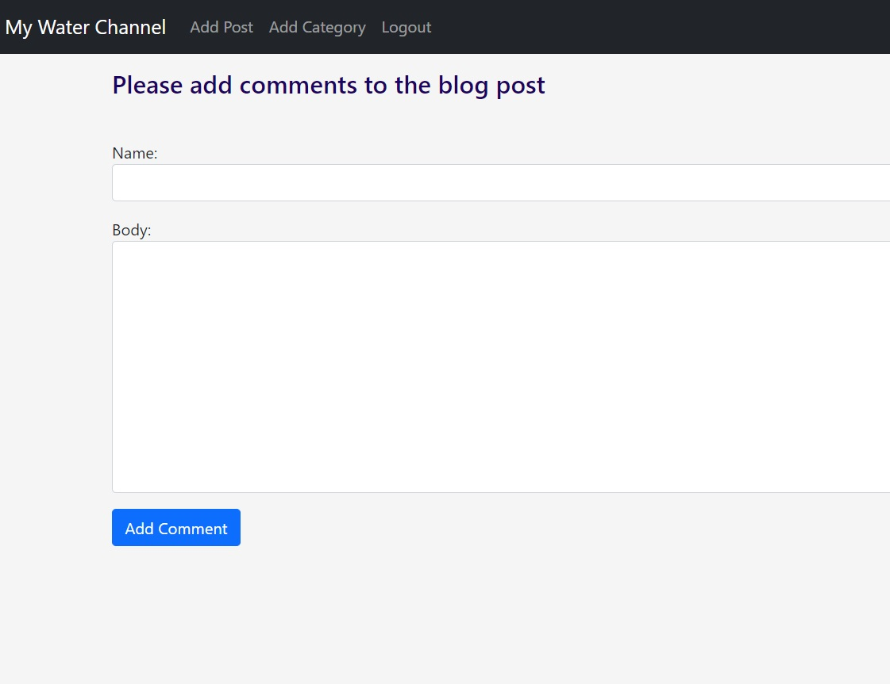

# Water Channel Blog 
Welcome! [IHE Delft](http://un-ihe.org)
## Introduction
The global water crisis is a major concern today and will become more severe in the coming years. The availability of freshwater becomes more challenging in the semi-arid regions. However, in other areas where freshwater is available(surface and groundwater),contamiantion and degradation of the water quality is a major issue risking the health of millions of people. As per the SDG 6, availability of fresh and safe water for all is a basic necessity for overall human development. Therefore, there is a need of ideas and solutions that can help to provide the clean freshwater to the entire population. 

The overall aim of this project is to develop an open access water channel blog with an objective to share the ideas and solutions to address global water issues. All the water practitioner from all over the world (including professional, students) can be a member of the community in this blog. 

A live water channel blog can be found [here](https://waterchanel.herokuapp.com/).

# Table of Contents
 [1. About the Water Channel Blog](#water-blog)

 [2. User Expereince (UX) design](#ux)
  - [User Goals:](#user-goals)
  - [Blog Design thinking:](#user-stories)

  [3. Features](#features)
 - [Existing features](#exist-feature)
 - [future features](#future-feature)

 [4.Technologies used](#technologies-used)

 [5.Testing](#testing)

 [6.Bugs](#bugs)

 [7. Deployment](#deployment)

[8. Acknowledgement](#acknowledgement)

  

# 1. About the Water Channel Blog
  [Go to the top](#table-of-contents)

This water channel blog is desinged as a a platform where water professional and students can share the expereince and ideas to solve the water related issues in the world. It can also be used as a knowledge sharing platform.  
   
# 2. User Expereince (UX) design
  [Go to the top](#table-of-contents)

  Water crisis is now a global issue which can be addressed by the joint efforts from professional working in this field. Therefore, sharing of knowledge and expereience among professional is important mainly to i)to save the available resources and time and ii) solve the global water issue. This project is thus aimed to design the user friendly water channel blog which allows all water professional to register and participate in sharing their knowledge and experience in water related issues.  

The following users types can be benifitted from the blog:

- Water professionals
- Students in field of water.
- University/institution who can consider the platform for thier educational activities.

   
## 2.1 User Goals
  [Go to the top](#table-of-contents)

The main goal of this project is to develop a user friendly water channel blog. This blog is of great important to me as I have planned to use the blog for the active particiaption/discussion among the students in the class.

  
## 2.1 Blog Design thinking
  [Go to the top](#table-of-contents)

The following design thinking were kept in mind while designing this channel. 
- Register
- Login and Logout
- Create Posts
- Category the post 
- Article Detailed View
- Comments
- Like Posts
- Edit and Delete Posts (own post)

Three step processes were followed as below:
- Set the user requirements and added to the user stories within the github project

- After the gradual fullfilment of the requirements, the stories were moved to in progress column.

- And finally when requirement was fully met, it was moved to the complete column.

 

# 3. Features
  [Go to the top](#table-of-contents)

## 3.1 Existing Feature

### 3.1.1 Navigation bar:
Water Channel has naviagation bar that includes; 
- My water channel (Home page)
- Register
- Login 
- Categories 

Any users have an ability to view the home page, page detail view, register in the webpage and login as registered user.

Once the users are registered and login in the page the naviagation bar has more functionality such as; add post, define categories of the post, edit/delete the post(only own post) and finally like the posts.

 

- Social media links (for facebook, Linkden, Twitter and Youtube) are placed at the bottom of the each page in the footer. All the links will open in a new tab. 

### 3.1.2 Django admistration page

The admin page is created where the admin has the ability right to the all functionality of the blog. For any new post admin should write title, slug (automatically populated), category of the post, author name (admin), attached image, add contet of the blog and finally published. 

### 3.1.3 Home Page (My water channel)

The channel has homepage where it listed the summary of recent posts. In the home page the post will appear with its title and short text (max 200) and picture. For detail view of the post, user can click on the more and then it redirect to the detail page.

Home page is design with functality of pagination. Each page only show 6 posts and there is a NEXT button at the bottom of page to go to the next page. The next page then has the PREVIOUS button to go back to the previous page.

### 3.1.4 Login and Register

The user is able to register, login and logout using the navbar navigation buttons using a new view or form to allow the user to login, logout or register. The users have an full access to post/edit/update/delate the post once they register and login.

### 3.1.5 Comment the post

It is allowed to registered Users to comemnt on their and other users post and is only possible when they logged in. The comment can be made in the post detail page. 

The user can write a comment about the blog by clicking on please provide comments. The name, date and time of comment will appear on the comment box.

## 3.1.6 Like the post

Registered Users are able to like post of theirs and other user's post but only when they are logged in. The total number of likes will be recorded on the post. This provides an opportuntiy to know how popular is the post. 

The like button also chnages colour to Red and allows the user to press again to Unlike.

### 3.1.7 Add Post in webbrowser

Registered Users are able to create their own posts within the app but only when logged in. They can do this from the Add Post button within the navbar

Each post is automatically stamped with the date of when the posts were uploaded.

### 3.1.8 Edit and Delete Post

Registered Users are able to edit or delete their own posts within the app but only when logged in.

When a user is not registered or logged in they are not shown the "Edit Post" or "Delete Post" buttons.

### 3.1.9 Add Categories of the post

Each post is given a category by choosing from the scroll down menu when creating a post. Each post is then added to the corresponding category list enabling the user to choose a category and view all posts within.

There is also a dropdown menu within the navbar to allow the user to choose a category to view from the homepage.

## Future Features

- Profile page to include bio and profile picture.
- Comments to automatically populate the username instead of adding name to form.

# 4. Technologies-used
  [Go to the top](#table-of-contents)

* [Python3](https://en.wikipedia.org/wiki/Python_(programming_language)) was used as a scripting language for the app development in this project.
* [HTML5](https://en.wikipedia.org/wiki/HTML5) (markup language) was used for structuring and presenting content of the website.
* [CSS3](https://en.wikipedia.org/wiki/CSS) (Cascading Style Sheets) was used to provide the style to the content written in a HTML.
* [Django](https://en.wikipedia.org/wiki/Django_(web_framework)) was used to for a rapid development and clean, pragmatic design as well as to provide the style to the content written in a HTML.
* [Github](https://github.com/) was used to create the repository and to store the cproject's code after pushed from Git.
* [Gitpod](https://www.gitpod.io/) was used as the Code Editor for the site to allow me to add, commit and push to GitHub
* [PEP8 online](http://pep8online.com/) tool was used for manual testing procedures for code validation.
* [W3C Markup](https://validator.w3.org/) and [Jigsaw validation](https://jigsaw.w3.org/) tools were used to validate the HTML code and CSS style used in the proejct.
* [Ami](http://ami.responsivedesign.is/) was used to develop a Mockup screenshot generator
* [Heroku](heroku.com) was used to deploy a final version of the Python Essentials application code.
* [Bootstrap](https://getbootstrap.com/) to make responsive design much easier due to their "mobile first" design.
* [Postgres](https://www.postgresql.org/) as Database Framework

* [Cloudinary](https://cloudinary.com/) was used to store all images uploaded to the website.

# 5. Testing
  [Go to the top](#table-of-contents)
## 5.1 General
- Throughout the development of the water channel blog I have tested each View, Model and URL together after each one had been written. 
- Any changes made in the models, I performed makemigrations and migrate. In the sametime, code for view.py and urls were also written and run the server to check if there are issues or not. I checked if the url written directed to the right page that i am expecting or not. 
- All the pages were manullay tested and well the the code written were validated using W3C validator (for Html), PEP8 online (Python) and Jigsaw (CSS). the details of each testing are summarized below.
## 5.2 W3C, Jigsaw and PEP8 online validation
  I have tested this project manually by passing the code through W3C, JigSaw and PEP8 online validation tool and confirmed there are no errors. The screenshot is as shown below:
  for W3C validation
  for Jigsaw validation
  for PEP8 validation
## 5.3 Mannual testing 

TEST            | OUTCOME                          | PASS / FAIL  
--------------- | -------------------------------- | ---------------
Water Channel(Home page) | checked if on click to "Water Channel", the browser redirects me to the Water Channel "home page".| PASS
Water Channel(Home page) | checked if recent posted blog appear on the the front page of home page or not.| PASS
Pagination | checked if there appears 6 blog posts in "Water Channel" home page or not. And after clicking to the button NEXT goes to the other pages where other additional blog posts appears.| PASS
Pagination | checked if bby clicking "PREVIOUS" button redirect to the previous page or not.| PASS
Detail page | checked if my clicking "more" on home page of each blog post redirect to the detail page or not.
| PASS
Detail page| checked if button "back" in detail page redirect to home page or not.| PASS
Post like| checked if registered user can like to blog post or not and registered the number of likes.| PASS
Comment | checked if on clicking "please provide comment" redirect to comment form page or not.| PASS
Comment | checked if registered user can comment ont he post or not and their comments appears on the detail blog page with name and date of comment.| PASS
Register/login|checked if users can register and login in the blog or not".| PASS
Edit/Delete post |checked if the post can be edited and deleted by the authorized resitered user only or not.| PASS
Catergory | checked if on click to each "Category", the browser redirects me to the the respective category page.| PASS

# 7. Bugs
  [Go to the top](#table-of-contents)

## 7.1 Solved bugs
- The update on static css did not show up in the page after heroku deployment. This was solved by chaning below;

    In setting.py

      1. debug = "DEVELOPMENT" in os.environ

        In, env.py add,

      2. os.environ["DEVELOPMENT"] = "true"  and 

    In Heroku setting remove:

      3. DISABLE_COLLECTSTATIC          1  

- The update in static CSS did not change in gitpod environment as well. This was solved by adding missing '/' STATIC URL = 'static/'

- The detail page edit did not work and it says the page cannot be reached. this was solved by adding missing '%' 
before url in the link below:
<a href="{ url 'edit_post' post.pk %}">(Edit)</a>

## 7.2 Unsolved bugs
No bugs remaining 

 

# 8. Deployment
  [Go to the top](#table-of-contents)

  The project was deployed to GitHub and pushed throughout the devlopment process. The project was also deployed to Heroku in the early stages of development to ensure that there weren't any issues later on in the project.
Auto deploy was selected within Heroku to ensure that each push from GitHub would push and deploy to Heroku.

## Method of Deployment

- In Heroku create new app 
- Added database to app using "Heroku Postgres"
- Set environment variables in env.py, "DATABASE_URL" and "SECRET_KEY"
- Copy DATABASE_URL to Settings.py
- Copy SECRET_KEY to Settings.py
- Migrate Changes

 

# 9. Acknowledgement
  [Go to the top](#table-of-contents)

* Inspired from Hello Django and I think I can blog project from the code institute course
* Thanks to my mentor Marcel Mulders for his constructive feedback
* Thanks to Youtube videos and especially to Codemy.com videos on Django projects