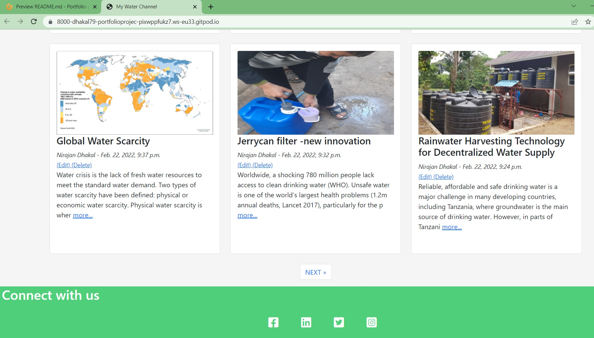

# Water Channel Blog 
Welcome! [IHE Delft](http://un-ihe.org)
## Introduction
The global water crisis is a major concern today and will become more severe in the coming years. The availability of 
freshwater becomes more challenging in the semi-arid regions. However, in other areas where freshwater is available(surface and groundwater),contamiantion and degradation of the water quality is a major issue risking the health of millions of people. As per the SDG 6, availability of fresh and safe water for all is a basic necessity for overall human development. Therefore, there is need of ideas and solutions that can help to provide the clean freeshwater to the entire population. 

The overall aim of this project is to develop open access water channel blog with an objective to share the ideas and solutions to address global water issues. All the water practictioner from all over the world (including professional, students) can be a member of the community in the blog. 

A live water channel blog can be found [here](https://waterchanel.herokuapp.com/).

# Table of Contents
 [1. About the Water Channel Blog](#water-blog)

 [2. User Expereince (UX) design](#ux)
  - [User Goals:](#user-goals)
  - [Blog Design thinking:](#user-stories)

  [3. Features](#features)
 - [Existing features](#exist-feature)
 - [future features](#future-feature)

 [4.Technologies used](#technologies-used)

 [5.Testing](#testing)

 [6.Bugs](#bugs)

 [7. Deployment](#deployment)

 [8. How does the blog works?](#blog-work)

 [9. Acknowledgement](#acknowledgement)

  

# 1. About the Water Channel Blog
  [Go to the top](#table-of-contents)

This water channel blog is desinged as a a platform where water professional and students can share the expereince and ideas to solve the water related issues in the world. It can also be used as a knowledge sharing platform.  
   
# 2. User Expereince (UX) design
  [Go to the top](#table-of-contents)

  Water crisis is now a global issue which can be address by joint efforts from professional working in this field. Therefore, knowledge, expereience sharing among professional is important to save the resources and time to solve the water issue. This project is thus aimed to design the user friendly water channel app which allows all water professional to register and participate in sharing the knowledge and experience.  

The following users types can be benifitted from the app:

- Water professionals
- Students in field of water.
- University to consider as a learning platform for sharing the expereince as case study.

   
## 2.1 User Goals
  [Go to the top](#table-of-contents)

The main goal of this project is to develop user friendly water channel blog . This is of great useful for me to apply in my teaching as a discussion platform with students.

  
## 2.1 Blog Design thinking
  [Go to the top](#table-of-contents)

The following design thinking were kept in mind while desiging this channel. 
- Login and Logout
- Register
- Create Posts
- Category the post 
- Article Detailed View
- Comments
- Like Posts
- Edit and Delete Posts (own post)

Three step processes were followed as below:
- Set the user requirement and added to the user stories within the github project

- After the gradual fullfilment of the requirement, the stories were moved to in progress colum.

- And finallym when requiment was fully meet, it was moved to the complete column.

 

# 3. Features
  [Go to the top](#table-of-contents)

## 3.1 Existing Feature

### 3.1.1 Navigation bar:
Water Channel included naviagation bar that include; 
- My water channel (Home page)
- Register
- Login 
- categories 

Any users has an ability to view the home page, page detail view, register in the webpage and login as registered user.

Once the users are registered and login in the page the naviagation bar has more functionality to add post, categories the post, edit and delete own post of the user as well as has an access to like other users post.

 

- Social media links (for facebook, Linkden, Twitter and Youtube) are placed at the bottom of the each page in the footer. All the links will open in a new tab. 
- At the bottom of each it is written By Nirajan Dhakal, 2022 

### 3.1.2 Django admistration page

The admin page is also created where the administration also has the ability to post, edit the blog, which include django summernote function. While posting the new post admin should write title, slug (automatically populated), author name (based on registration), attached image, and text area for exerpt, contet of the blog. It also has an option to choose the category of new post, and finally status as draft or published. 

### 3.1.3 Home Page (My water channel)

The channel has homepage where it listed the recent summary of recent posts with title and short text including picture. Once the user likes the post, there is an option to click more to redirect to the post detail page.

Home page is design with functality of pagination. Each page only show 6 posts and there is a NEXT button at the bottom of page to go to the next page. The next page then has the PREVIOUS button to go back to the previous page.

### 3.1.4 Login and Register

The user is able to register, login and logout using the navbar navigation buttons using a new view or form to allow the user to login, logout or register. The users have an full access to post/edit/update/delate the post once they register and login.

### 3.1.5 Comment the post

It is allowed to registered Users to comemnt on their and other users post and is only possible when they logged in. The comment can be made in the post detail page. 

The user can write a comment about the blog by clicking on please provide comments. The name, date and time of comment will appear on the comment box.

## 3.1.6 Like the post

Registered Users are able to like post of theirs and other user's post but only when they are logged in. The total number of likes will be recorded on the post. This provides an opportuntiy to know how popular is the post. 

The like button also chnages colour to Red and allows the user to press again to Unlike.

### 3.1.7 Add Post in webbrowser

Registered Users are able to create their own posts within the app but only when logged in. They can do this from the Add Post button within the navbar

The user is directed to the Add Post form where they can create their Blog Post. There are 5 sections to the form.

Title - a text field to allow user text input.
Title Tag - a text field to allow user text input.
Category - a dropdown menu to allow the user to choose which category they wish their post to sit within.
Body - Text Editor to allow text input
Image - Allows for user to upload images to their posts

The form uses a Text Editor to provide the user with a better UX and also allows for different fonts, Bold Text, Italic Text etc.

Once the Post has been created the user clicks the "Post" button to upload their post to the home page of the web app.

## Date

Each post is automatically stamped with the date of when the posts were uploaded.

### 3.1.8 Edit and Delete Post

Registered Users are able to edit or delete their own posts within the app but only when logged in.

When a user is not registered or logged in they are not shown the "Edit Post" or "Delete Post" buttons.

### 3.1.9 Add Categories of the post

Each post is given a category by choosing from the scroll down menu when creating a post. Each post is then added to the corresponding category list enabling the user to choose a category and view all posts within.

There is also a dropdown menu within the navbar to allow the user to choose a category to view from the homepage.

## Future Features

- Profile page to include bio and profile picture.
- Comments to automatically populate the username instead of adding name to form.

#

# 4. Technologies-used
  [Go to the top](#table-of-contents)

* [Python3](https://en.wikipedia.org/wiki/Python_(programming_language)) was used as a scripting language for the app development in this project.
* [HTML5](https://en.wikipedia.org/wiki/HTML5) (markup language) was used for structuring and presenting content of the website.
* [CSS3](https://en.wikipedia.org/wiki/CSS) (Cascading Style Sheets) was used to provide the style to the content written in a HTML.
* [Django](https://en.wikipedia.org/wiki/Django_(web_framework)) was used to for a rapid development and clean, pragmatic design as well as to provide the style to the content written in a HTML.
* [Github](https://github.com/) was used to create the repository and to store the cproject's code after pushed from Git.
* [Gitpod](https://www.gitpod.io/) was used as the Code Editor for the site to allow me to add, commit and push to GitHub
* [PEP8 online](http://pep8online.com/) tool was used for manual testing procedures for code validation.
* [W3C Markup](https://validator.w3.org/) and [Jigsaw validation](https://jigsaw.w3.org/) tools were used to validate the HTML code and CSS style used in the proejct.
* [Ami](http://ami.responsivedesign.is/) was used to develop a Mockup screenshot generator
* [Heroku](heroku.com) was used to deploy a final version of the Python Essentials application code.
* [Bootstrap](https://getbootstrap.com/) to make responsive design much easier due to their "mobile first" design.
* [Postgres](https://www.postgresql.org/) as Database Framework

* [Cloudinary](https://cloudinary.com/) was used to store all images uploaded to the website.

# 5. Testing
  [Go to the top](#table-of-contents)

- Throughout the development of the water channel blog I have tested each View, Model and URL together after each one had been written. 
- Any changes in the models
After migrating any models I would run the server whilst writing the code for the views and urls and watch the terminal show up any errors whilst writing the code. This would enable me to generally notice an issue in real time.
- Once the URL's were written and implemented as links within the app I would test each one to ensure that they worked correctly and directed me to the required page.
- The links were again tested in the final stages of development.
- Forms were also tested in the final stages to ensure that hey work as should. I registered multiple accounts and then deleted to ensure that this functionality works as it should. All error messages displayed and user information displayed as should also.
- Additional manual testing of the finished app included using dev tools to render the webpages within a mobile phone screen. Due to using bootstrap this functionality is automatic meaning less coding for different viewports.
## 6.1 PEP8 online validation
  I have tested this project manually by passing the code through PEP8 online validation tool and confirmed there are no errors. The screenshot is as shown below:
  
## 6.2 Mannual testing 
### 6.2.1 Google sheet
TEST            | OUTCOME                          | PASS / FAIL  
--------------- | -------------------------------- | ---------------
Google sheet | checked if the data provided in the google sheet is either float number or integer only except table heading. If that is not true then a message pop up "google sheet data is not valid ! Please check the data entry".| PASS

## 6.2.2 User input 
TEST            | OUTCOME                          | PASS / FAIL  
--------------- | -------------------------------- | ---------------
User input | checked if the data provided by user is either integer or float or positive. In case not true then it gives an error message "Please enter numeric value greater than 0" and "Enter value can't be zero or negative, try again". This message po up until the correct input value is provided by user.| PASS
Optimum coagulant dose calculation | checked if the app calcualte the correct optimum coagulant dose or not for all four given conditions based on the google sheet data and criteria used. | PASS
Total coagulant dose calculation based on user input| checked if all the total coagulant dose calulated by the app based on the users input data and app calcualted optimum coagulant dose is correct or not. | PASS
Update google sheet | checked if the data calculated by the app and users input data is updated or not in the googlesheet. | PASS
Update google sheet data in new row | Checked if the data updated in the google sheet is not overwrtten the previously recorded data but instead it is recorded in the new row| PASS

# 7. Bugs
  [Go to the top](#table-of-contents)

## 7.1 Solved bugs
- When i wrote the project, i had most frequently indentation error as i forget to provide a tab
- The data input by users and app calcualted results were overwritten in the google sheet with the previously recorded data. this was solved by writing a code to save the evry new data entry and app calcualtion in a new row.
- When i wrote if statement, i forget to add colon at the end of if statement, which gave me unexpected indentation error. 
- I want to display the calcualted data in bullet points in the app but it took all the data from google sheet (including headings and data). This was solved by using pretty_array package.

## 7.2 Unsolved bugs
No bugs remaining 

 

# 8. Deployment
  [Go to the top](#table-of-contents)

  The proejct was deployed to Heroku using the following steps:
- Sign up to Heroku and give a unique name to the app
- Inside the Heroku app page, go to the setting first and in the section config vars, add CREDS and paste entire creds.json file
- Add buildpack python and node.js (python on top and node.js on bottom)
- Go to the diploy section and select github and click connect to github
- Search git hub repository name related to the project to be depoloyed and click connect 
- Deploy to the branch (either mannual or automatic)

 

# 9. How does the app works?
  [Go to the top](#table-of-contents)

## 9.1 Google data access and validation
The app has a credential to access google data sheet . The app validates the data input in the google sheet. If the data entry in google sheet is not correct the app gives a message"Google sheet data is not valid. Please check the data entry" (see figure below where data input is not valid in google sheet (highlighted)). Moreover the app users do not have to do anything to the google sheet.

## 9.2 Start of the APP
When the users run the coagulant dose calcualtor Heroku  app,
- It first display the what the app is about.
-  Ask user to enter flow rate in m3/s and do the validation of the data. 
- After validation of first input data, the user is asked to provide second input data i.e., storage time. The app does the validation of this second input as well.

## 9.3 Validation of user input
App validate the user's input data both flow rate and storage time (is data integer, float, and greater than 0). If data is not correct it ask users multiple time to provide correct input.

## 9.4 App calcualtion

If user's input data is validate, the program runs and calcualte the following:
- Optimum coagulant dose for all conditions.
- Total coagulant dose (for differnt type of coagulant used i.e. FeCl3) is calcualted based on the optimum coagulant dose and users input data of flow rate and storage time. This is calculated for all four types of conditions like pHRAW, pHRAW2, pHRAW3 and pHRAW4.

## 9.5 Google data sheet update 
All the new calcualtion and user's input data are updated in the google sheet 
- no overwritten with previous data entry is allowed, 
- data should be entered in new row
- in each simualtion four rows will be added for four differnt types of experimental conditions (pHRAW, pHRAW2, pHRAW3 and pHRAW4)
- Experimental condition is also recored in the last column to understand which data belong to what experiemntal condtions

## 9.6 Re-start the program 
To run the programm again, user has to click again run the programme.

# 10. Acknowledgement
  [Go to the top](#table-of-contents)

* Inspired from love sandwitch project from the code institute course
* Thanks to my mentor Marcel Mulders for his constructive feedback